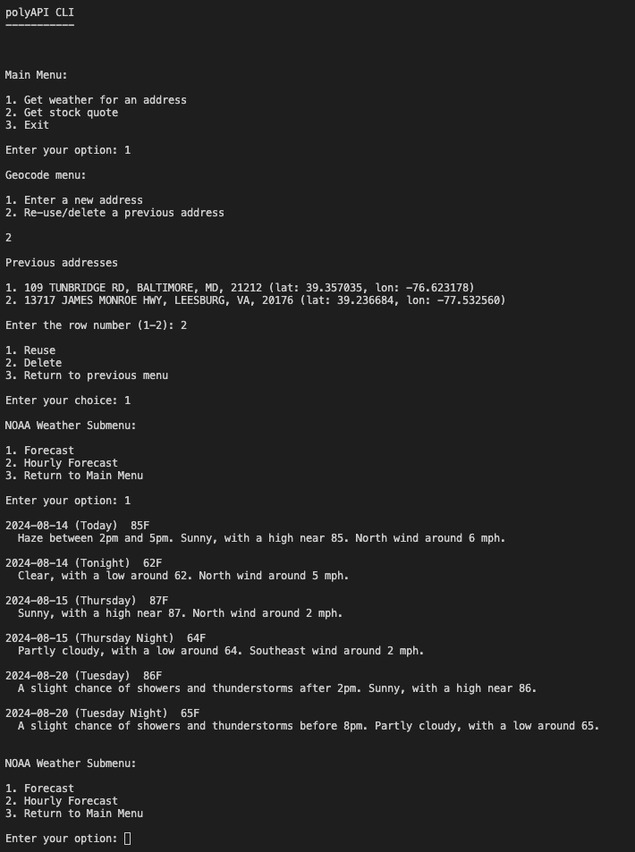

# An API app written in Go

polyapi has retrieves personal information from many (poly) disparate APIs within a CLI app that you may historically retrieve on web pages. Go is a cross-platform, statically typed and compiled programming language. A dev container (development container) is a self-contained dev environment with a Docker container allowing portability and instant creation of a dev environment without manual installation.

## Lastest update

This is a new project and actively under development.

## Currently implemented functionality
1. Reads environment variables like API keys
1. Shows weather by geocoding an address entered
1. Shows stock ticker data
1. Stores validated addresses and ticker symbols in a local SQLite3 database for re-use or deletion



## SQLite3 local database

At program start, a db directory and `polyapi.db` are created. `db/` is added to a `.gitignore` file so they will not be included in the code repository.


## dev container

I'm using a dev container so I don't have to install Go on my Mac. All I need a is a Docker daemon, which in my case is `colima` and VS Code with the dev container extension.

## API providers

### Weather for Addresses (United States Census Bureau and National Oceanic and Atmospheric Administration)

NOAA's API provides weather forecast information but requires latitude and longitude coordinates. The U.S. Census bureau has an API has a geocoding that returns coordinates based on a valid address. No API keys required for both APIs.

### Stock Quotes (Alpha Vantage)

Get a [free API key](https://www.alphavantage.co/support/#api-key) to retrieve stock quote data. Add an environment variable in your configuration script e.g., `.zshrc` or `bashrc` that the dev container reads. 

```sh
export ALPHAVANTAGE_API_KEY=""
```

## Resources

[Go](https://go.dev/)

[Dev Container specification](https://containers.dev/implementors/spec/)

## License

This project is licensed under the [MIT License](LICENSE)

## Contributing

### Disclaimer: Unmaintained and Untested Code

Please note that this program is not actively maintained or tested. While it may work as intended, it's possible that it will break or behave unexpectedly due to changes in dependencies, environments, or other factors.

Use this program at your own risk, and be aware that:
1. Bugs may not be fixed
1. Compatibility issues may arise
1. Security vulnerabilities may exist

If you encounter any issues or have concerns, feel free to open an issue or submit a pull request.